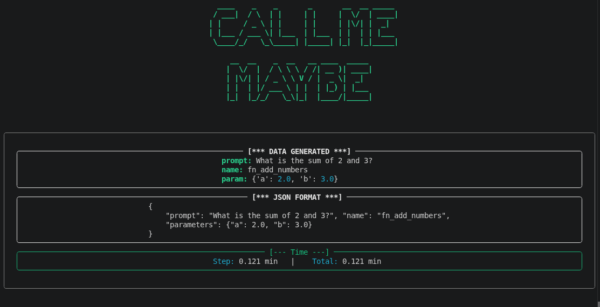

*This project has been created as part of the 42 curriculum by mait-mou.*

# call_me_maybe
<p align="center">
  
</p>

## Description

**call_me_maybe** is a function-calling tool that translates natural-language prompts into structured JSON function calls using a small language model (Qwen/Qwen3-0.6B). Instead of answering a question directly (e.g. returning `42` for "What is the sum of 40 and 2?"), the program outputs the selected function name and typed arguments (e.g. `fn_add_numbers` with `{"a": 40.0, "b": 2.0}`).

The core challenge is reliability: small models often fail to produce valid JSON when prompted freely. This project solves that with **constrained decoding** — at each generation step, invalid tokens are masked out so the output is always syntactically valid JSON and schema-compliant.

## Instructions


### Prerequisites

- Python 3.10 or later
- [uv](https://docs.astral.sh/uv/) package manager


### Installation

```bash
make install
# or
uv sync
```


### Execution

Default paths read from `data/input/` and write to `data/output/`:

```bash
make run
# or
uv run python3 -m src
```

With custom paths:

```bash
make run -m src ARGS="\
  --function_definition data/input/functions_definition.json \
  --input data/input/function_calling_tests.json \
  --output data/output/function_calling_results.json"

# or

uv run python3 -m src \
  --function_definition data/input/functions_definition.json \
  --input data/input/function_calling_tests.json \
  --output data/output/function_calling_results.json
```


### Other Makefile targets


| Target             | Description                                   |
| ------------------ | --------------------------------------------- |
| `make install`     | Install dependencies via `uv sync`            |
| `make run`         | Run the main program                          |
| `make debug`       | Run with Python debugger (`pdb`)              |
| `make clean`       | Remove `__pycache__`, `.mypy_cache`, etc.     |
| `make lint`        | Run `flake8` and `mypy` with project settings |


## Example usage

```bash
# Process default test files
uv run python -m src

# Expected output file
cat data/output/function_calling_results.json
```

Example output entry:

```json
{
    "prompt": "What is the sum of 2 and 3?",
    "name": "fn_add_numbers",
    "parameters": {"a": 2.0, "b": 3.0}
}
```


## Algorithm explanation

Generation is token-by-token using the LLM SDK's `get_logits_from_input_ids`. At each step:

1. **Prompt construction** — A system prompt lists available functions with parameter types; the user prompt is appended in Qwen chat format.
2. **JSON prefix** — Generation starts from the fixed prefix `{"name":"`.
3. **Function name selection** (`get_fn_name`) — Logits are masked so only token IDs that appear in encoded function names are allowed. Tokens are greedily selected until a complete function name matches the definitions.
4. **Parameter extraction** (`get_parames`) — After injecting `", "parameters":{`, each parameter is generated according to its type:
  - **number** — Only digit, decimal, and sign token IDs are allowed; value is parsed as `float`.
  - **string** — Vocabulary-sized masking restricts tokens to valid vocab entries; generation stops at the closing quote delimiter.
5. **Output assembly** — Results are collected per prompt and written as a JSON array.

This approach guarantees 100% valid JSON structure because invalid tokens receive `-inf` logits before argmax selection.

## Design decisions

- **LLM-driven function selection** — Function names are chosen by constrained LLM decoding, not heuristics or keyword matching.
- **Pydantic models** — Input files are validated with `Prompt` and `FunctionDefinition` models for type-safe loading.
- **Separate concerns** — `data_loader` handles I/O, `build_promp_output` builds prompts and writes output, `constrained_decoding` contains the core generation logic.
- **Greedy decoding** — Argmax is used at each step for deterministic, fast generation.
- **Custom tokenizer module** (`tokenizer.py`) — Bonus exploration of vocab-based encode/decode without relying on the SDK's `encode`/`decode` in the main pipeline.


## Performance analysis

- **Accuracy** — Constrained decoding ensures valid JSON on every run. Function selection accuracy depends on the 0.6B model's logits but masking prevents malformed output.
- **Speed** — Each prompt requires multiple forward passes (one per token). Processing the full test suite completes within the subject's 5-minute target on standard hardware.
- **Reliability** — Input errors (missing files, invalid JSON, schema mismatch) are caught and reported via `LoadError` without crashing.


## Challenges faced

- **Token-level schema enforcement** — Mapping vocabulary tokens to valid JSON fragments required careful use of the vocab file and encoded delimiter strings.
- **Number vs. string parameters** — Different masking strategies were needed: numeric tokens for numbers, full-vocab filtering for strings.
- **Multi-token function names** — Function names span several tokens; generation continues until a complete name matches a defined function.


## Testing strategy

1. Place input files in `data/input/`.
2. Run `uv run python -m src` and verify `data/output/function_calling_results.json` is created.
3. Validate JSON structure: each entry must have `prompt`, `name`, and `parameters` keys.
4. Cross-check function names and parameter types against `functions_definition.json`.
5. Test edge cases manually: negative numbers, decimal values, string parameters, and ambiguous prompts.


## Resources

- [Pydantic documentation](https://docs.pydantic.dev/)
- [Qwen3 model card](https://huggingface.co/Qwen/Qwen3-0.6B)
- [Rich documentation](https://rich.readthedocs.io/en/stable/)

